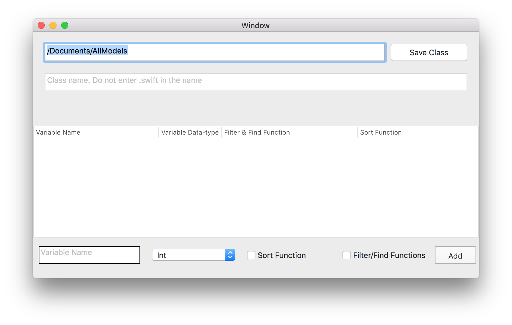
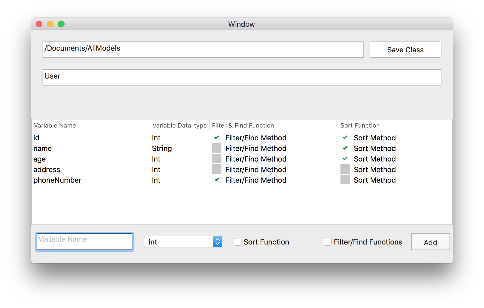
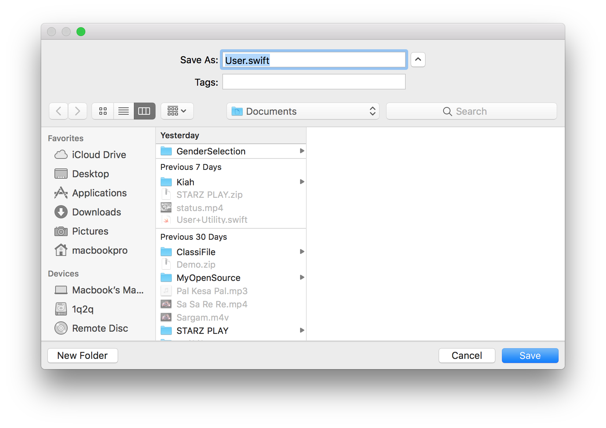

# ClassiFile(1.0) 

An Open Source Mac app to created Automated Swift Classes + Extensions for your model

=======
## Download App
To download this app click on the link below.

ClassiFile [Download📥](https://drive.google.com/file/d/1SLsNjmOjz9kSC7gyyxwlQEZC-_sUqPkF/view?usp=sharing)

## MacApp Screenshots.

### Add Variables
In below input area you can add you variable by entering their *name*, *type*, *need sort method*, *need filter and find method* and then click on *Add* button.



### Generate Class
When ever you add a variable you can see it in a list for with variable name and their complete information.



### Save Files.
Finaly click on Save button to successfully save you class.



## In-App Models
There are few models we have defined to draw dynamic code.
* **A**: `Class` is a model which is crystal clear with name. `Class` has few attributes that define its prior logic.
    * **1**: `name` which store the name of class.
    * **2**: `variables` is an Array of type `Variable` this array contains all entered variables.
            to add a variable in class you can use below method.
            
    `classObj.addVariable(name: "id", variableType: .string, shouldHaveSort: true, shouldHaveFilter: false)`
    
* **B**: `Variable` is model to store information about a single variable. `Variable` contains some attributes use for special purpose.
    * **1**: `name` store the name of a variable.
    * **2**: `type` is enumeration of type `VariableType` which store the data type of variable.
    * **3**: `shouldHaveSortMethod` is boolean which interprets whether this class needs sorting method by this variable or not. `By Default this attribute will be false`.
    * **4**: `shouldHaveFindFilterMethod` is boolean which interprets whether this class needs filter and find methods for this variable or not. `By Default this attribute will be false`.
    * **5**: `variableSecurity` is an enumeration of type `CodeSecurity` which tell the access specifier of current variable. `By default this will be .public`.
    * **6**: `nameOfClass` this attributes contains the name of the class of which this variable belongs. You do not need to assign this value.

* **C**: `Extension` this is class which is responsible to create extension file for your class which desired method i.e `filter/find/sort`. You just need to initialized like this. `Extension(with: yourClassObject)`. Extension class will automatically traverse each variable and check if there is any variable that requested to have some method in extension or not. Just save this initialize extension.

* **D**: `File` is class of a file which have attributes.
    * **1**: `name` is the name of creating file.
    * **2**: `localURL` is the path where this file should store.
    * **3**: `completeCode` is a string which have entire string of the code which will save in this file.


>Both `Class` and `Extension` is the subclass of class `File`. This class holds the common properties of a class file and extension file.

## Enumerations
Enumerations that we use in this projects are following.
```
enum CodeSecurity: String {
case publicVar = "public"
case internalVar = "internal"
case openVar = "open"
case privateVar = "private"
case filePrivateVar = "filePrivate"
}

enum VariableType: String {
case int = "Int"
case string = "String"
case float = "Float"
case double = "Double"
case bool = "Bool"
case date = "Date"
case void = "Void"
}
```

`CodeSecurity` is being used for making any **functions**, **variables** and **classes** either `public`, `private` etc.

`VariableType` is primarily used as `DataType` of each variable which this enumeration can reuse as data type of a function as well.


Currently this project only focus to create only **Swift** classes.
We are contributing to make development more riliable and fast.
**Your help will be appriciated and warmly welcome.**

# Contributors
* [Syed Qamar Abbas (Facebook)](https://www.facebook.com/syedqamar.a)
* [Muhammad Umair (Facebook)](https://www.facebook.com/umair.sharif99)
